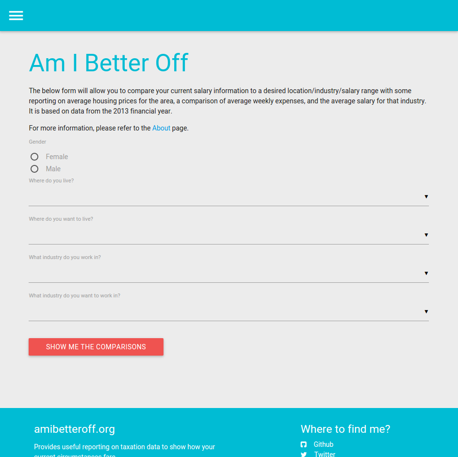
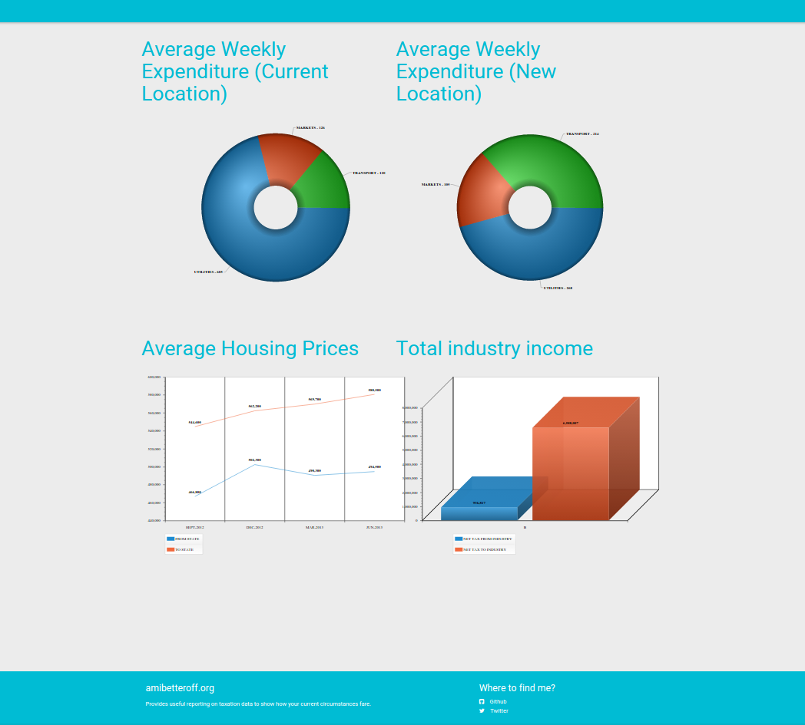

# Amibetteroff.org

Am I better off is a project that was created a part of the GovHack 2015 event.

The idea of this project is to give people the opportunity to see what the cost of living differences will be in different geographical area's.

The web interface was built with Oracle Application Express, and uses a theme developed by [Vincent Morneau](https://github.com/vincentmorneau/material-apex), which is inspired by Google Material Design.

## Data

To make this project possible, we utilised data from both the Australian Taxation Office (ATO) and the Australian Bureau of Statistics (ABS) - both for the 2013 financial year.

1. ATO - Tax table 5: https://data.gov.au/dataset/taxation-statistics-2012-13/resource/5be9bac4-8bbd-45bb-a686-b7f017260699
2. ABS - Residential Dwellings: Values, Mean Prices and Number by State and Territories: http://govhack.abs.gov.au/Index.aspx?themetreeid=10

## Installation

1. Create a schema for your database
*. Run the script scripts/ddl.sql
* Run the script scripts/data.sql
* Create a workspace in Application Express
* Import the application export file f102381.sql

## Usage

Run your application - or if you want to demo the publically hosted demo, go to: https://apex.oracle.com/pls/apex/f?p=102381.

Fill out the form with your details.

Then click the `show me the comparisons` button, and you will be shown the analysis.

